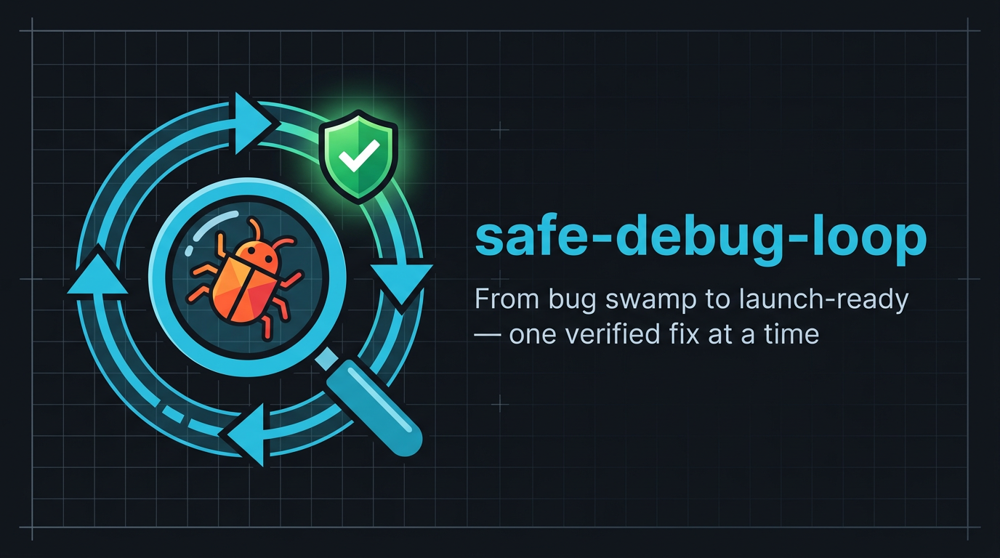

<p align="center">
  
</p>

<p align="center">
  <a href="https://skills.sh/Shavy72/claude-skill-safe-debug-loop"></a>
  <a href="LICENSE"></a>
  <a href="https://github.com/Shavy72/claude-skill-safe-debug-loop/stargazers"></a>
</p>

# safe-debug-loop

**A multi-session Claude Code skill for the strategic remediation of complex dashboard/app modules that have too many bugs for an MVP launch.**

Instead of ad-hoc fixes you build strategically: first knowledge plus a bug inventory (Phase 1, one session), then iterative and safe fixing with an isolated smoke test per bug (Phase 2, second session). Every loop iteration also improves logging, documentation and code comments — so that future debugging keeps getting easier across sessions.

---

## Quickstart

```bash
npx skills add Shavy72/claude-skill-safe-debug-loop
```

Then in Claude Code, invoke `/safe-debug-loop` to start.

---

## When you need this skill

When your module is built — UI/UX is there, program flow is there, the backend talks to several APIs, maybe it is already live — **but it contains so many bugs that you cannot launch.** Every ad-hoc fix could indirectly break something else (multi-API wiring, shared state, complex dependencies).

**Classic trigger phrases:**
- "I can't launch this like that"
- "too many bugs for beta"
- "I'm going in circles"
- "the module is live but broken"
- "MVP launch impossible"

**What the skill does NOT do:**
- Build the main functionality (the module has to exist already)
- Fix a single stubborn bug (use `deep-debugger` / `investigate` for that)
- Quick audit "does this run?" (use `audit-verify-loop` for that)

---

## How it works

### 3 invocation modes

| Invocation | What happens |
|---|---|
| `/safe-debug-loop` | Onboarding: the skill explains the workflow and prints 2 copy-paste console start commands for 2 sessions |
| `/safe-debug-loop Phase 1` | Straight into Phase 1 (in a fresh MAX-effort session) |
| `/safe-debug-loop Phase 2` | Straight into Phase 2 (fresh session OR in the middle of an active chat) |

### Phase 1 — researcher + detective (fully autonomous, NO code touched)

**Part 1: radical knowledge expansion**
- Persona: hyper-focused researcher who never stops digging
- Absorbs every relevant piece of knowledge: module code, external API docs (scraped completely), endpoints, schemas
- Uses tool symbiosis: all installed skills, MCPs and plugins in parallel
- Persisted to: `.bug-sweep/research/` plus the notes vault (if available)
- Stop condition: 100% confidence level (validated via `agent-council`)

**Part 2: radical cross-check**
- Persona: the world's best intelligence/police investigator
- Compares the current module code against the gathered knowledge
- Finds ALL bugs, categorised 🔴 red / 🟡 yellow / 🟢 green
- Produces a complete bug plan with fix order and blast radius

**Phase 1 output:**
- `.bug-sweep/bug-plan-<ISO>.md` with the complete bug list plus a plan per bug
- A start prompt for Phase 2, ready to copy and paste

### Phase 2 — iterative bug-fix loop with smoke test

Per bug:
1. **Tool-symbiosis check** — which skills/MCPs help right now?
2. **Bug selection + existence check** — which bug, and does it still exist? (If already fixed → mark it and move on)
3. **Explain it to a 12-year-old** — explain the bug simply, why it is a global problem, why the fix is minimally invasive
4. **Apply the fix** — pre-check (holistic) + edit + atomic commit
5. **Isolated smoke test** — faithful sandbox, dummy data, reproduce, verify, clean up
6. **Tick the bug off + write the smoke-test log**
7. **Logging/docs/comment upgrade** for this area
8. **`/compact` suggestion** → next bug

The loop runs until the plan is fully worked through.

---

## Installation

### skills CLI

```bash
npx skills add Shavy72/claude-skill-safe-debug-loop
```

### Claude Code Plugin

```
/plugin marketplace add Shavy72/claude-skill-safe-debug-loop
/plugin install safe-debug-loop@claude-skill-safe-debug-loop
```

### git clone (recommended for tracking updates)

```bash
git clone https://github.com/Shavy72/claude-skill-safe-debug-loop ~/.claude/skills/safe-debug-loop
```

**Manual copy:** copy the `safe-debug-loop/` directory from this repo into `~/.claude/skills/`.

**Verify:**
```bash
ls ~/.claude/skills/safe-debug-loop/
# Should show: SKILL.md, references/, templates/, README.md, LICENSE
```

Test it in Claude Code: just invoke `/safe-debug-loop` — the skill triggers.

### Prerequisites

**Required:**
- Claude Code CLI
- Git
- Filesystem access

**Strongly recommended (for the skill's full power):**
- `agent-council` skill (for 100% confidence validation)
- `firecrawl` MCP (for massively parallel doc scraping)
- `perplexity` MCP (for web research)
- `context7` MCP (for library docs)
- `code-review-graph` MCP (for architecture mapping)
- `browse` skill (gstack) OR `playwright` MCP (for UI smoke tests)
- A notes-vault MCP OR a local vault (for a cross-project knowledge base)

The skill also works without them — it just prints gap hints and falls back to slower alternatives.

---

## Persistence structure

The skill creates the following in the project repo:

```
.bug-sweep/
├── research/                    # Phase 1 knowledge base
│   ├── module-overview.md
│   ├── api-docs/
│   ├── endpoints.md
│   └── dependencies.md
├── bug-plan-<ISO>.md            # Phase 1 output
├── adhoc-bugs-<ISO>.md          # Phase 2 standalone bugs
├── smoke-tests/
│   └── <bug-id>-smoke-log.md    # Per-bug smoke-test log
└── debug-journal.md             # Cross-session
```

If a notes vault is available, `research/` is additionally mirrored to `<vault>/projects/<project>/safe-debug-loop/`.

---

## Example workflow

```
[Terminal 1]
$ cd ~/projects/dashboard-module
$ claude
> /effort max
> /safe-debug-loop Phase 1

→ The skill works autonomously for ~20-90 min depending on module size
→ Result: .bug-sweep/bug-plan-2026-05-27.md with 24 bugs
→ A start prompt for Phase 2 is printed

[Terminal 2 — in parallel]
$ cd ~/projects/dashboard-module
$ claude
> /effort max
> /safe-debug-loop Phase 2

→ The user pastes the start prompt from terminal 1
→ The skill starts the loop for the first bug
→ Per bug the user goes through 3 copy-paste prompts plus a smoke test
→ One atomic commit per bug
→ After each bug: a /compact suggestion

→ After N bugs: the module is MVP-ready
```

---

## Iron laws

1. **Phase 1 changes NO production code.** Only `.bug-sweep/` and the notes vault grow.
2. **Before every LLM call: tool-symbiosis check.** Use all installed skills, MCPs and plugins in symbiosis.
3. **Per bug: 1 loop. 1 smoke test. 1 atomic commit.** Never several bugs in parallel.
4. **Holistic thinking at every step.** No fix may break other working places.
5. **Build up logging and docs iteratively.** Every bug also improves logging and documentation.
6. **Cleanup duty.** After the smoke test, remove all dummy data and test leftovers.

---

## When to escalate

- Smoke test failed 3× → hand off to the user with concrete options
- Blast radius >5 files for 1 bug → get user confirmation
- Unsure about a security-sensitive change → STOP, the user decides

---

## Maintenance + contributions

The skill is maintained at [Shavy72/claude-skill-safe-debug-loop](https://github.com/Shavy72/claude-skill-safe-debug-loop).

Issues and PRs welcome.

---

## Changelog

See [CHANGELOG.md](CHANGELOG.md).

---

## License

MIT. See [LICENSE](LICENSE).
